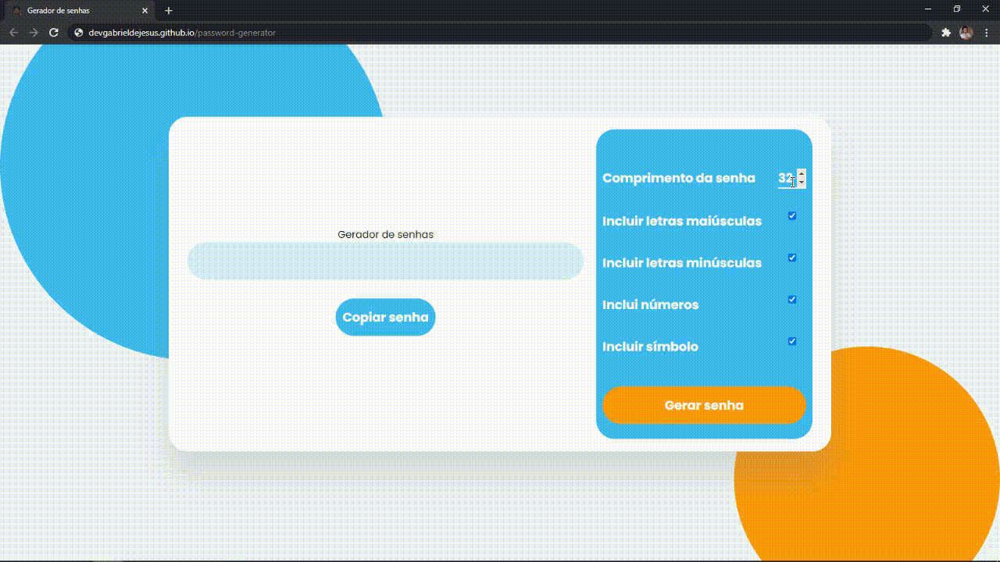

# Under maintenance

Generator of random passwords based on what the user selects (uppercase letters, lowercase letters, numbers, symbols, etc.).

`Web preview`

## Deployment in
https://devgabrieldejesus.github.io/password-generator

## Release history

* 0.0.1
    * Work in `progress`

## Meta

Gabriel de Jesus – [My portfolio](https://www.gabrieldesenvolvedor.com/) – oi@gabrieldesenvolvedor.com

Distributed under the MIT License. See `LICENSE` for more information.

[https://github.com/devgabrieldejesus/password-generator](https://github.com/devgabrieldejesus/)

## Contributing

1. Fork it (<https://github.com/devgabrieldejesus/password-generator/fork>)
2. Create your feature branch (`git checkout -b feature/fooBar`)
3. Commit your changes (`git commit -am 'Add some fooBar'`)
4. Push to the branch (`git push origin feature/fooBar`)
5. Create a new Pull Request
